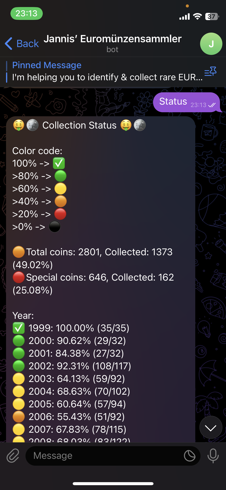

# Coinbot 🤖🪙


I am building one of the largest collection of different euro coins collected from free currency circulation.
Each euro coin has:
- a value (1 cent to 2 euro)
- a country (currently 20)
- a year (1999 until today)
- (German coin mints additionally have a single character denoting the minting location)

As of mid 2024, there are 2801 coins, from which i have collected almost 1400 (~50%). 
This Telegram coinbot helps me (and enthusiastic fellows) to identify and catalog new coins. It's perfect for numismatics enthusiasts and casual collectors alike!

Text the Telegram coinbot with [@coincollectionbot](https://t.me/coincollectionbot)

<div align="center">
  
</div>


### Screenshots 📸

| Request | Status |
|:-------:|:------:|
|  |  |


# Development Setup 🛠️


## Installation

```sh
git clone https://github.com/jannisborn/coinbot.git
cd coinbot
poetry install
poetry shell
```

## Local deployment

NOTE: You will need the `secrets.json` file with the tokens for Telegram and Anyscale (LLMs) and the public link to the source file. Open an issue if you need help 

Then run:
```sh
python app.py
```


# Production 🌐

On Linux, place the file `coinbot.service` (TODO: ADD RELATIVE LINK HERE) into your `/etc/systemd/system/`. Then run:

```sh
sudo systemctl daemon-reload # Reload daemon
# start on boot
sudo systemctl enable coinbot.service 
sudo systemctl start coinbot.service
```

Some useful commands:

```sh
# Check service is up
sudo systemctl status coinbot.service

# Restart service
sudo systemctl restart coinbot.service

# Fetch logs
journalctl -u coinbot.service

# Remove logs
sudo journalctl --vacuum-time=1s
```