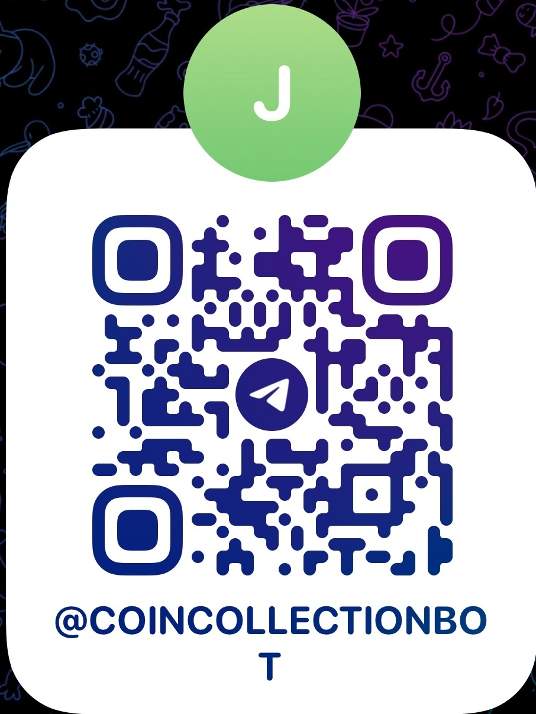
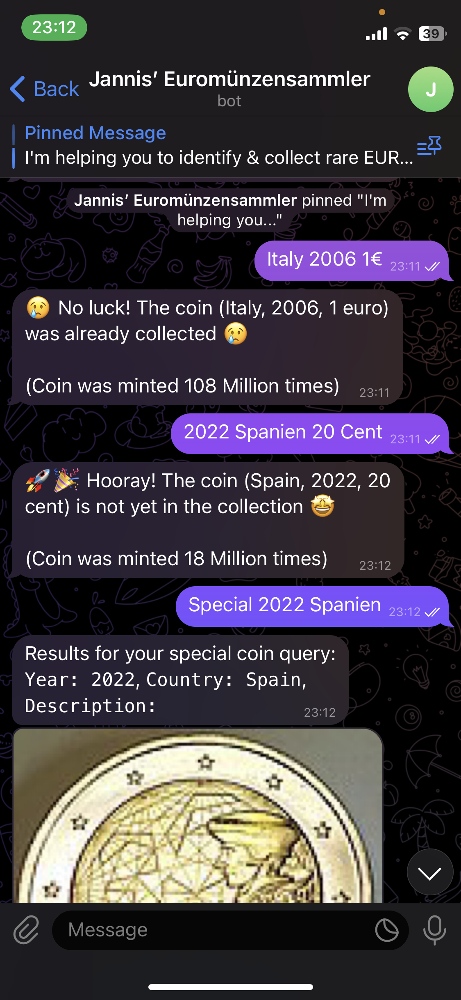
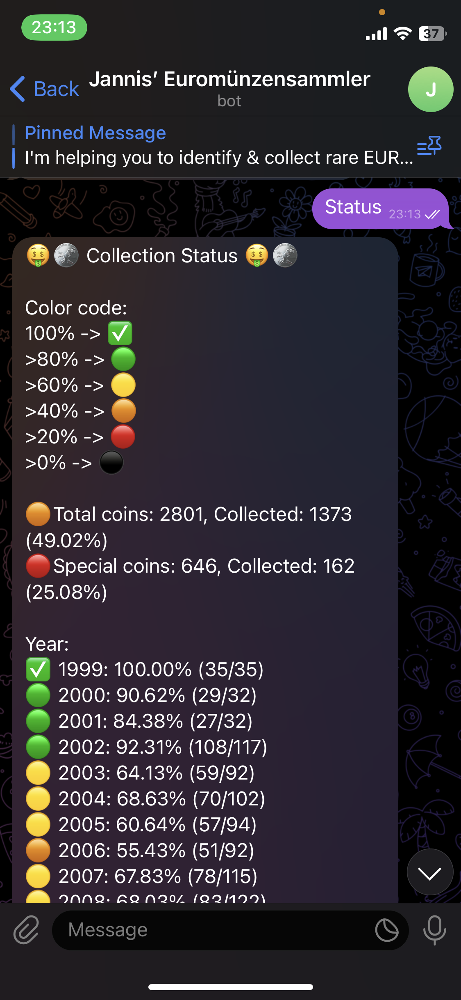

# Coinbot 🤖🪙


I am trying to build a pretty large collection of different euro coins found in
normal circulation. This bot is the slightly over-engineered helper for it,
because checking a spreadsheet every time someone finds a coin got old quickly.

Text it a coin and it tells you whether I already have it, whether it is still
missing, how many were minted, and whether you should keep it for me 🥳

Text the Telegram coinbot here: [@coincollectionbot](https://t.me/coincollectionbot)

<div align="center">
  
</div>

## Collection Status 📊

As of summer 2026, the database tracks **3,095 collectible euro coin variants**
from **24 countries and microstates**, covering coins from **1999 to 2025**.

Current progress, roughly:

- **1,664 collected** ✅
- **1,431 still missing** ❌
- **54% complete** 🚀
- **715 special / commemorative 2 euro entries**, of which **188 are collected**

The CSV also contains a lot of `unavailable` rows. Those are useful because the
bot should know the difference between "we still need this coin" and "this coin
probably was never minted".

## What Counts As A Coin? 🧐

For regular circulation coins I track:

- coin value, from 1 cent to 2 euro
- issuing country
- year
- mint mark for German coins: `A`, `D`, `F`, `G`, or `J`

For special 2 euro coins, the bot also tracks the commemorative design,
description, image link, mintage, and country-specific variants where relevant.

## Features ✨

### Coin Lookup 🔎

Ask about a specific coin in natural language:

```text
Spain 2010 1 Euro
20 Cent 2021 Germany D
France 2024 2 euro
```

The bot tries to extract the country, year, value, and German mint mark if
needed. Then it replies with the current status:

- already collected 😢
- still missing 🤩
- staged for collection by someone
- unavailable or probably not minted 🤯

If the coin is missing, the bot offers a Telegram button to stage it. This marks
the coin as "someone found this, it should arrive soon" and stores who found it.

### Series Reports 📋

Start a message with `Series` to inspect a larger group of coins:

```text
Series France 2010
Series missing 2001
Series Germany 2024
Series 2 euro 2025
```

Series reports are useful when you do not care about one coin, but want to check
a whole country, year, value, or just the missing ones.

### Special 2 Euro Search 🪙

Start a message with `Special` to search commemorative 2 euro coins:

```text
Special Austria
Special Germany 2015
Special Olympics
Special Germany Hamburg 2023
```

Special coin search can filter by country, year, German mint mark, and text from
the coin name or description. It also returns pictures when available, because
for special coins the picture is usually the only sane way to identify them.

### Collection Status 📈

The bot can summarize collection progress:

```text
Status
Status 02.01.2024
Status Diff 02.01.2024 26.07.2024
Status Staged
```

It can also show currently staged coins:

```text
Staged
```

And it can list the most active collectors:

```text
Hoarders
```

### Language And User Setup 🌍

On first contact, the bot asks for a display language and a user name. These can
be changed later:

```text
Language: English
Name: Jannis
```

The lookup logic stays the same, but outgoing bot messages can be translated via
the configured LLM backend. This is mostly useful because not everyone helping
with the collection wants English replies.

## Screenshots 📸

| Request | Status |
|:-------:|:------:|
|  |  |

## Setup 🛠️

Install dependencies with `uv`:

```sh
git clone https://github.com/jannisborn/coinbot.git
cd coinbot
uv sync
```

You need a local `secrets.json` file:

```json
{
  "telegram-token": "...",
  "together": "...",
  "file_link": "https://...",
  "slack": "..."
}
```

`slack` is optional. `file_link` points to the source spreadsheet. The bot also
expects the local data files under `data/`, including `latest_collection.csv` and
the vector index used for special coin search.

## Running The Bot 🚀

I do not use the old `systemctl` setup anymore. On the server I just run it in a
`screen` session:

```sh
screen -S coinbot
uv run python app.py
```

Detach from the session with `Ctrl-A` then `D`, and resume it later with:

```sh
screen -r coinbot
```

The app runs Telegram polling and periodically reloads the spreadsheet from the
configured public link.
